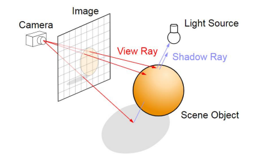
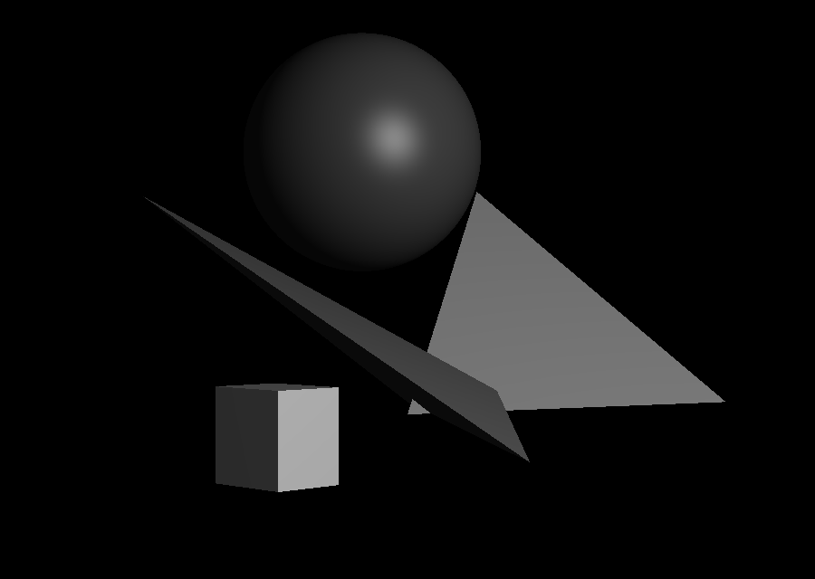

# RayTracing
## Постановка и описание:

В пространстве есть некая точка обзора (камера). Также в пространстве находится некая трехмерная структура (сцена). Между ними находится прямоугольник, разделенный на квадратные пиксели (экран).

  

Задача трассировки лучей состоит в том, чтобы провести луч из точки обзора через центр каждого пикселя экрана - и посмотреть, пересекает ли он какой-либо объект в сцене. Если луч пересекает какой-либо объект, нужно закрасить пиксель нужным цветом.

В качестве объектов можно использовать произвольное количество сфер, тетраэдров и параллелепипедов. Пространство для наблюдателя имеет следующее представление: наблюдатель смотрит в угол начала координат, где ось `x` направлена влево, а ось `y` - вправо

Проект написан на чистом c++ включает в себя различные состовляющие ООП, такие как фабрики, виртуальные методы, наследование, а также  параллельные вычисления с OpenMP и небольшую часть иерархии ограничивающих объёмов.

## Parameter file (parameter.txt):
1) Координаты камеры `x`, `y`, `z` (три действительных числа);
2) координаты нормали к экрану (три действительных числа);
3) координаты вектора перпендикулярного нормали к экрану, определяющий направление "up" (три действительных числа);
4) расстояние от камеры до экрана `a0` (одно действительное число);
5) расстояние от камеры до границы видимости `a0 + a1` (одно действительное число); 
6) вертикальный угол обзора `α` (одно действительное число);
7) ширина `w` и высота `h` экрана в пикселях (два целых числа);
8) координаты источника света (три действительных числа)

## Oblect file (objects.txt):
1) сферы задаеются перечислением координат центра, а затем радиуса
2) Тетраэдры определяются четырьмя точками в пространстве
3) Параллелипеды определяются двумя противоположными угловыми точками в пространстве.                                                                                                     
Файл может содержать неограниченное количество фигур в любом порядке
Примеры готовых файлов можно найти в репозитории

## Наивная установка:
1) клонируйте репозиторий
2) измените параметры в `.txt` файлах
3) запустите `main.cpp`

## Результат:

  

